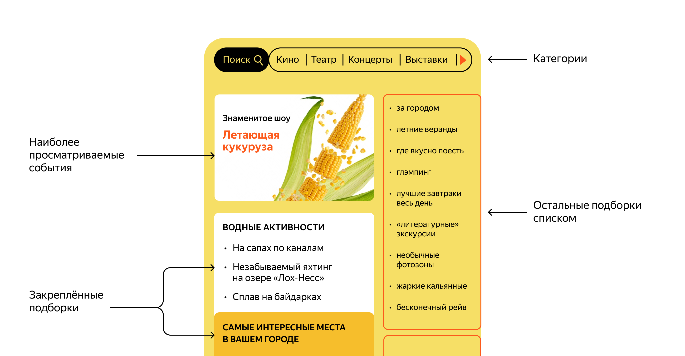

# ExploreWithMe
Приложение ExploreWithMe (англ. «исследуй со мной») позволяетт пользователям делиться информацией об интересных событиях и находить компанию для участия в них.

Свободное время — ценный ресурс. Ежедневно мы планируем, как его потратить — куда и с кем сходить. Сложнее всего в таком планировании поиск информации и переговоры. Нужно учесть много деталей: какие намечаются мероприятия, свободны ли в этот момент друзья, как всех пригласить и где собраться.

## Дополнительная возможность сервиса - ставить лайк/дизлайк событию
### [ссылка](https://github.com/anbananova/java-explore-with-me/pull/3)
1. Возможность ставить лайк/дизлайк событию.
2. Формирование рейтинга мероприятий и рейтинга их авторов.
3. Возможность сортировки событий в зависимости от рейтингов. 
4. Рейтинг событий виден всем пользователям.
5. Рейтинг авторов виден только авторизованным пользователям.
6. Рейтинг можно ставить только посещенным событиям.
7. Администратор может удалить (обнулить) весь рейтинг событию.